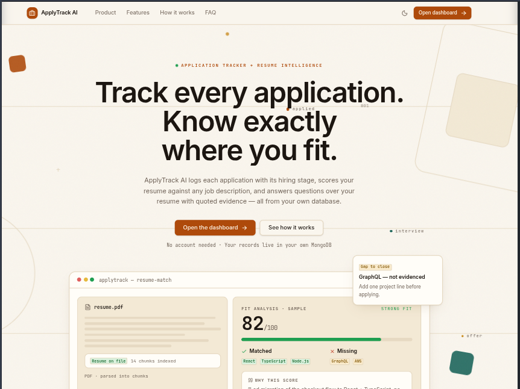

# ApplyTrack AI


A single-user job-application tracker with AI resume intelligence: log every
application and hiring stage, score your resume against any job description,
and ask questions over your uploaded resume with quoted evidence.

## Preview

> Add your screenshot at `assets/project-screenshot.png` — it will render here.



## Overview

Job searches scatter across tabs, inboxes, and spreadsheets, and tailoring a
resume for each posting is guesswork. ApplyTrack AI gives applications one
home — a searchable pipeline backed by your own MongoDB — and adds resume
intelligence on top:

- **Application tracking** — every application with company, role, stage
  (`applied → screening → interview → offer → hired`, plus `rejected` /
  `withdrawn`), search, stage filter, and sorting, with real counts on the
  overview dashboard.
- **Resume Match** (`POST /api/match`) — paste resume text and a job
  description to get a 0–100 fit score with matched skills, missing skills,
  and a short explanation, scored by the configured chat model from the two
  texts only.
- **Resume Assistant** (`POST /api/rag/query`) — upload a PDF resume (parsed,
  chunked, embedded, indexed) and ask questions. Answers are grounded in
  retrieved resume passages and quote the exact supporting excerpts; when the
  resume holds no evidence, the API says so plainly instead of guessing.
- **Landing page + dashboard** — marketing landing (`/`) and app dashboard
  (`/app/*`: overview, applications, resume match, resume assistant) with
  light/dark themes and loading, empty, and error states throughout.

Single-user v1 — no authentication. Without an `OPENROUTER_API_KEY`, tracking
works fully and the AI routes return an explicit `503` instead of fabricated
results.

## Key features

| Area | What it does |
| --- | --- |
| Applications API | Full CRUD, text search, status filter, `recent`/`oldest`/`company` sort, paginated list, `/stats` counts |
| Resume Match | Score + matched/missing skills + explanation; strict 50–20,000 char validation; retries provider rate limits and empty answers |
| Resume upload | PDF-only upload (`multer`), text extraction (`pdf-parse`), overlapping chunks, OpenRouter embeddings, failure-safe activation that never loses the current resume |
| Resume Q&A (RAG) | Embedding retrieval (Atlas Vector Search with in-app cosine fallback), question-aware rerank, grounded generation with validation that rejects excerpts dumps, numeric fabrications, and internal markers |
| Frontend | React Router pages, TanStack Query data layer with timeouts and actionable network errors, Vite `/api` dev proxy, honest backend-status UI on failures |
| Reliability | Centralized error envelope `{ ok, error }`, CORS allow-list + loopback hosts, health endpoint reporting DB + AI status |

## Technologies used

**Frontend** (`frontend/`)

- React 19, Vite 8, TypeScript, Tailwind CSS v4
- React Router 7, TanStack Query 5, React Hook Form + Zod
- Radix UI primitives, Lucide icons, class-variance-authority / clsx / tailwind-merge
- oxlint for linting

**Backend** (`backend/`)

- Node.js ≥ 20, Express 4, TypeScript, tsx (dev)
- MongoDB / Mongoose 8, Zod validation, Multer, pdf-parse
- Helmet, CORS, Morgan, express-async-errors, dotenv
- Vitest + Supertest + mongodb-memory-server (110 tests across 10 files)

**AI providers** (via OpenRouter, key optional)

- Embeddings (default `openai/text-embedding-3-small`, 1536 dims) and chat
  generation (configurable `RAG_CHAT_MODEL`) for match scoring and grounded Q&A.

## Project structure

```text
ApplyTrack-AI/
├── README.md
├── assets/
│   └── project-screenshot.png   # add your screenshot here
├── backend/
│   ├── package.json             # dev / build / start / typecheck / test
│   ├── .env.example
│   ├── src/
│   │   ├── app.ts               # Express app, CORS, routers, error handlers
│   │   ├── index.ts             # startup: connect DB, then listen
│   │   ├── config/env.ts        # zod-validated environment
│   │   ├── db/connect.ts        # Mongoose connect/disconnect
│   │   ├── routes/              # health, applications, resumes, rag, match
│   │   ├── schemas/             # zod request/response contracts
│   │   ├── models/              # Application, Resume, ResumeChunk
│   │   ├── lib/                 # chunk, embeddings, retrieval, generation, match, similarity, parsePdf
│   │   └── middleware/          # AppError, notFound + centralized error handler
│   └── tests/                   # applications, match, rag, rag-quality, rag-regression
└── frontend/
    ├── package.json             # dev / build / lint / preview
    ├── .env.example
    ├── vite.config.ts           # /api dev proxy to the backend
    └── src/
        ├── App.tsx              # routes: / + /app (overview, applications, resume-match, resume-assistant)
        ├── pages/               # Landing, Overview, Applications, ResumeMatch, ResumeAssistant
        ├── components/          # landing, layout, dashboard, ui, forms, badges, theme toggle
        ├── lib/                 # api client (timeouts, friendly network errors), theme, utils
        └── types.ts             # ApplicationStatus, ApplicationItem, StatsResponse
```

## Prerequisites

- Node.js ≥ 20 and npm
- MongoDB — local (`mongodb://127.0.0.1:27017/applytrack-ai`) or Atlas
- (Optional, for AI features) An OpenRouter API key. Without it, application
  tracking works fully; match/RAG routes return `503` with a clear message.

## Installation and setup

```bash
# 1. Clone
git clone https://github.com/muskan-wagh/ApplyTrack-AI
cd ApplyTrack-AI

# 2. Backend
cd backend
cp .env.example .env   # then edit MONGODB_URI (and OPENROUTER_API_KEY for AI)
npm install

# 3. Frontend (new terminal)
cd frontend
cp .env.example .env   # empty VITE_API_URL uses the Vite /api proxy (recommended)
npm install
```

## Environment variables

Backend (`backend/.env`) — see `backend/.env.example`:

| Variable | Required | Default | Purpose |
| --- | --- | --- | --- |
| `MONGODB_URI` | Yes | — | MongoDB connection string (local or Atlas) |
| `PORT` | No | `5000` | Backend listen port |
| `CORS_ORIGIN` | No | `http://localhost:5173,…` | Allowed browser origins (loopback hosts always allowed) |
| `OPENROUTER_API_KEY` | For AI only | `""` | Enables match scoring, embeddings, and RAG answers |
| `EMBEDDING_MODEL` / `EMBEDDING_DIMS` | No | `openai/text-embedding-3-small` / `1536` | Embedding model and vector size |
| `RAG_CHAT_MODEL` | No | `openai/gpt-4o-mini` | Chat model for match + assistant |
| `RAG_TOP_K` / `RAG_MIN_SCORE` | No | `5` / `0.1` | Retrieval depth and noise filter |
| `MAX_RESUME_MB` / `MAX_RESUME_CHARS` | No | `5` / `200000` | Upload size and text-length caps |

Frontend (`frontend/.env`) — see `frontend/.env.example`:

| Variable | Required | Default | Purpose |
| --- | --- | --- | --- |
| `VITE_API_URL` | No | `""` (same-origin `/api` via Vite proxy) | Set to `http://localhost:5000/api` only to point at a remote backend |

Never commit `.env` files — both apps gitignore them.

## Run locally

```bash
# Terminal 1 — backend (http://localhost:5000/api/health)
cd backend
npm run dev

# Terminal 2 — frontend (http://localhost:5173)
cd frontend
npm run dev
```

Useful commands:

```bash
cd backend && npm test        # vitest suite (mongodb-memory-server, no live DB needed)
cd backend && npm run typecheck
cd backend && npm run build && npm start   # production: tsc -> node dist/index.js
cd frontend && npm run build  # tsc -b + vite build
cd frontend && npm run lint   # oxlint
cd frontend && npm run preview
```

## API reference (backend)

- `GET /api/health` → liveness plus `{ db, ai: { configured, chatModel } }`
- `POST /api/applications` — `{ company*, role*, status?, appliedDate?, location?, jobUrl?, source?, notes? }`
- `GET /api/applications?q=&status=&page=&limit=&sort=` (`sort`: `recent`/`oldest`/`company`)
- `GET /api/applications/stats` → `{ total, applied, interviews, offers, byStatus }`
- `GET /api/applications/:id`, `PATCH /api/applications/:id`, `DELETE /api/applications/:id`
- `POST /api/resumes/upload` — multipart `file` (PDF); `GET /api/resumes/current`
- `POST /api/rag/query` — `{ question, topK? }` → `{ answer, sources: [{ label, snippet }] }`
- `POST /api/match` — `{ resumeText, jobDescription }` → `{ score, matchedSkills, missingSkills, explanation }`

## AI Development Experience — Code0

Code0 (AI-assisted development in the terminal environment) was used
throughout this project's recent development. The agent inspected the real
codebase, made targeted edits, and verified each change by running the actual
test suites, type checks, and production builds — no features, APIs, or
results were invented.

Specific tasks Code0 helped with:

1. **Diagnosing and fixing the Resume Match `Failed to fetch` error** —
   traced the failure to the backend not running plus an overly strict CORS
   allow-list, then fixed it permanently: permissive loopback CORS in
   `backend/src/app.ts`, a Vite `/api` dev proxy, and a rewritten
   `frontend/src/lib/api.ts` with request timeouts and actionable error
   messages. Verified end to end with live `POST /api/match` calls.
2. **Hardening backend error handling and observability** — extended
   `GET /api/health` with DB/AI status, mapped `express.json` syntax errors
   to clear 4xx responses, and added OpenRouter attribution headers to the
   match, generation, and embedding clients.
3. **Restructuring assistant evidence for users** — replaced internal chunk
   labels (`Page 1 · Chunk 2`) leaking into the UI with user-facing
   `Resume excerpt N` labels (`buildSources` in `routes/rag.ts`), rewrote the
   `Sources` component in `ResumeAssistant.tsx` as an explained numbered
   list, and updated the regression test expectation.
4. **Landing-page animation polish** — refined the existing CSS +
   IntersectionObserver motion system (hero preview depth entrance, tab-panel
   transitions, hover/press states, smooth anchors, `prefers-reduced-motion`
   coverage, no-JS fallback) without adding dependencies or gradients.
5. **Verification and testing** — ran the backend vitest suite (110 tests, 10
   files, all passing), frontend `oxlint`, `tsc` type checks, production
   `vite build`, and a `vite preview` smoke test serving the landing page.

**Git and GitHub via the Code0 terminal:** the repository was already
initialized with history; the terminal was used for staging (`git add`),
committing with meaningful messages, inspecting diffs and status, and pushing
to GitHub — including commit `41efc38` ("Fix match network failures, CORS,
and evidence labels"), pushed to `origin/main`. No secrets were committed
(`.env` files are gitignored and were scanned before pushing).

## Future improvements

- Multi-user support with authentication (v1 is explicitly single-user).
- Persisted match history per application instead of paste-and-score only.
- One-click Atlas Vector Search index provisioning (currently manual, with an
  automatic in-app cosine-similarity fallback).
- Production deployment configuration (backend `start` + static frontend
  hosting with same-origin `/api`).

## Assessment checklist

- [x] Public GitHub repository with clear structure and meaningful commits
      (`https://github.com/muskan-wagh/ApplyTrack-AI`, branch `main`)
- [x] Professional README with real features, stack, structure, and setup
- [x] AI Development Experience — Code0 section with specific tasks
- [x] No secrets committed (`.env` gitignored; diffs scanned)
- [ ] **Your action:** confirm the repo is set to **Public** on GitHub
      (visibility can't be changed from the terminal)
- [ ] **Your action:** save your app screenshot as
      `assets/project-screenshot.png` (PNG) so the Preview section renders
